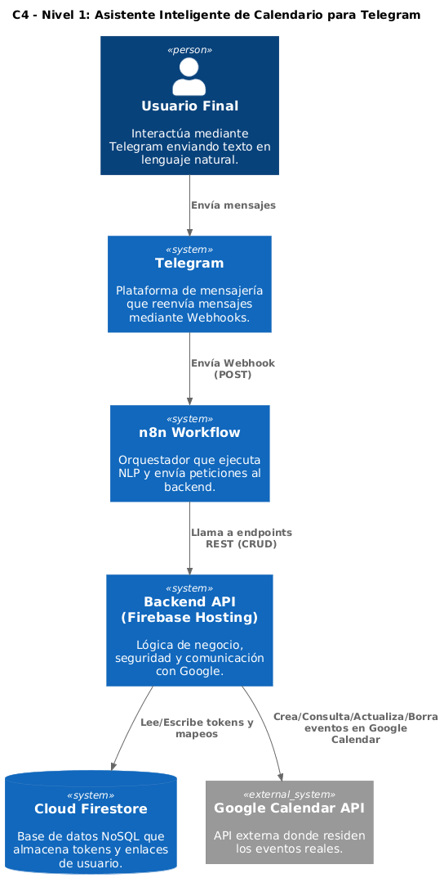
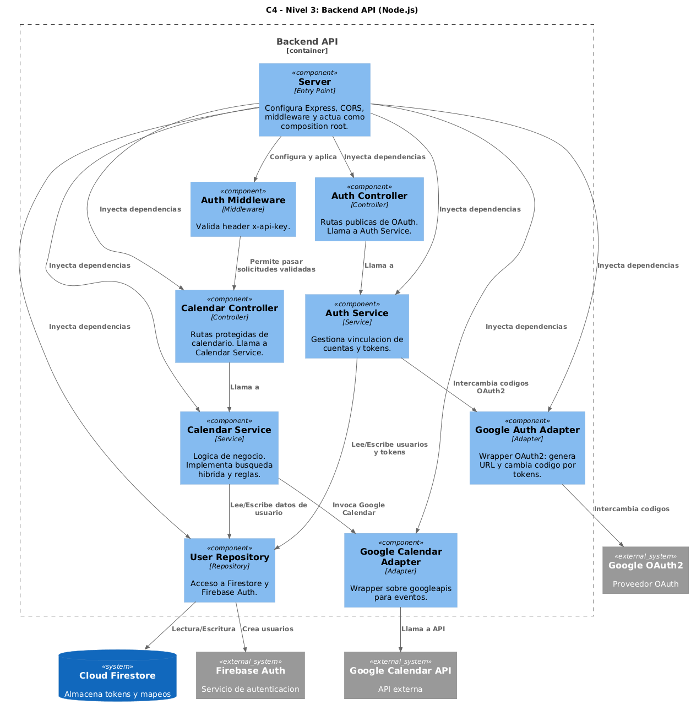
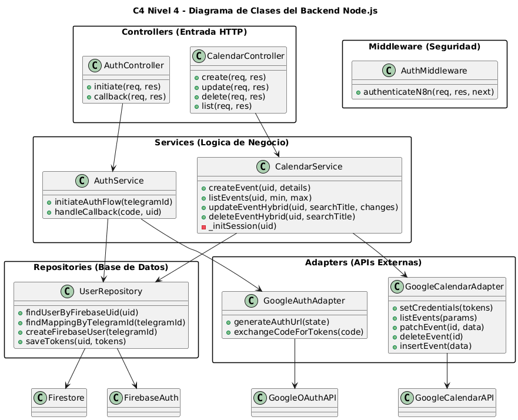
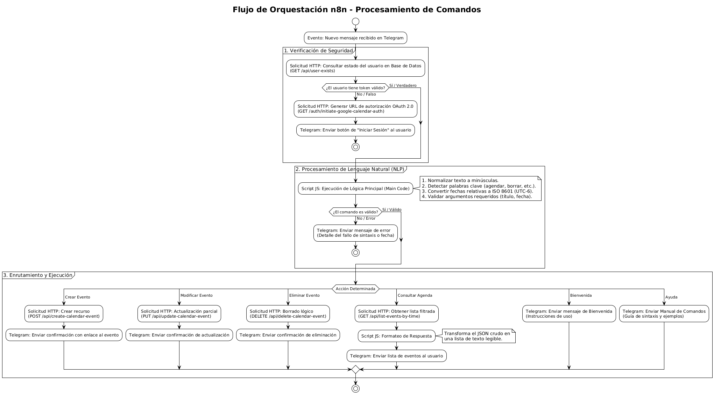

# 📅 Asistente Inteligente de Calendario (Telegram Bot + Google Calendar)

## 1. Introducción

### 1.1 Descripción General del Sistema
Este proyecto consiste en el desarrollo de un **asistente virtual inteligente** que integra la plataforma de mensajería **Telegram** con la API de **Google Calendar**. Su propósito es optimizar la gestión del tiempo permitiendo a los usuarios administrar sus eventos (creación, consulta, modificación y eliminación) mediante una interfaz conversacional basada en texto.

El sistema implementa una arquitectura técnica dividida en dos componentes principales:
1.  **Orquestación y Procesamiento (n8n Cloud):** Actúa como la capa de inteligencia, alojada en la nube (SaaS), encargada de recibir los mensajes de Telegram e interpretar el lenguaje natural (NLP). Este módulo normaliza las fechas relativas (ej. "mañana", "en una semana") y estandariza los formatos horarios.
2.  **Lógica de Negocio y Seguridad (Backend en Firebase):** Un servidor desarrollado en Node.js que gestiona la comunicación segura con Google. Este backend implementa protocolos de autenticación **OAuth 2.0**, maneja la persistencia de sesiones y utiliza algoritmos de **búsqueda híbrida** para garantizar la integridad de los datos.

### 1.2 Declaración del Problema (Problem Statement)
**Contexto:** Hoy en día, usamos aplicaciones como Telegram para organizar casi toda nuestra vida personal y laboral. Sin embargo, existe una desconexión: acordamos reuniones dentro del chat, pero para agendarlas debemos salir de la aplicación y usar interfaces gráficas manuales en Google Calendar.

**Problemas Específicos:**
1.  **Demasiados pasos:** Crear un evento en la app nativa requiere múltiples clics y navegación.
2.  **Ruptura del flujo:** Salir del chat interrumpe la comunicación.
3.  **Confusión temporal:** Traducir mentalmente "el próximo viernes" a una fecha exacta induce a errores.
4.  **Dificultad de edición:** Modificar eventos en móvil es lento comparado con un comando de texto.

**Impacto:** Olvidos frecuentes, empalme de horarios (*double-booking*) y pérdida de tiempo productivo en tareas administrativas.

---

## 2. Guía de Usuario (Comandos)

El bot utiliza procesamiento de lenguaje natural. Los comandos empiezan con `/` y los argumentos se separan con una barra vertical `|`.

### 🧠 Formatos de Fecha y Hora Soportados (Regex)
| Tipo | Formato Aceptado | Ejemplo Real |
| :--- | :--- | :--- |
| **Relativo** | `hoy`, `mañana` | `hoy a las 18:00` |
| **Formal** | `Día de Mes` | `4 de diciembre` |
| **Corto** | `Día Mes` (Sin "de") | `4 diciembre`, `25 enero` |
| **Con Año** | `Día Mes Año` | `4 diciembre 2025` |
| **Hora** | `HH:MM`, `am`, `pm` | `18:00`, `6pm`, `9 am` |

### 1. 📅 Agendar Eventos (`/agendar`)
* **Rápido (1h por defecto):** `/agendar Gym | hoy 18:00`
* **Completo:** `/agendar Reunión | mañana 9am | mañana 10:30am`
* **Con Detalles:** `/agendar Cena | hoy 8pm | Ubicación: Centro | Descripción: Regalo`

### 2. 🔍 Modificar Eventos (`/modificar`)
* **Mover Horario:** `/modificar Gym | hoy 19:00`
* **Reagendar:** `/modificar Cena | 12 de diciembre 20:00 | 12 de diciembre 23:00`
* **Actualizar Datos:** `/modificar Cita | hoy 5pm | Ubicación: Consultorio 2`

### 3. 🗑️ Cancelar Eventos (`/cancelar`)
* **Comando:** `/cancelar Título del Evento` (Requiere coincidencia exacta).

### 4. 🗓️ Consultar Agenda (`/checar`) cantidad | formato (dia, semana o mes)
* **Tiempo Real:** `/checar hoy` (Muestra solo eventos pendientes del día).
* **Día Completo:** `/checar mañana`.
* **Rangos:** `/checar 1 semana`, `/checar 3 dias`, `/checar 1 mes`.

### 5. 🆘 Asistencia
* **Inicio:** `/start` (Bienvenida y verificación de cuenta).
* **Ayuda:** `/help` (Manual de sintaxis).

> **Nota:** Para consultar mas información de los comandos consultar la [Guia de comandos](./guia_de_comandos.md)
---

## 3. Alcance del Proyecto

### ✅ Funcionalidades Incluidas (In-Scope)

1.  **Gestión de Identidad y Onboarding:**
    * Detección de nuevos usuarios y generación de enlaces OAuth 2.0.
    * Vinculación persistente `TelegramID <-> Google Account` en Firestore.
2.  **Creación de Eventos:**
    * Interpretación de lenguaje natural con normalización a `America/Mexico_City`.
    * Regla de duración implícita (60 min) y proyección de año automática.
3.  **Consulta de Agenda:**
    * Filtros dinámicos: Tiempo Real ("hoy") vs. Días Futuros vs. Rangos Naturales.
4.  **Modificación de Eventos:**
    * **Búsqueda Híbrida:** Global (Índice Google) + Fallback Local (Escaneo +/- 7 días).
    * **Edición Parcial (PATCH):** No borra datos no mencionados.
5.  **Eliminación de Eventos:**
    * Búsqueda extendida (3 meses futuros) para localizar el evento antes de borrar.

### ❌ No se incluye (Out-of-Scope)
* Gestión de recurrencia (eventos repetitivos).
* Notificaciones Push proactivas.
* Resolución de conflictos de disponibilidad.
* Soporte para calendarios secundarios.
* Archivos adjuntos.

---

## 4. Actores del Sistema

| Actor | Tipo | Responsabilidades Principales |
| :--- | :--- | :--- |
| **Usuario Final** | Primario | Enviar comandos, autorizar OAuth y gestionar su agenda. |
| **Google Calendar API** | Secundario | Validar credenciales, persistir eventos y ejecutar operaciones CRUD. |
| **Plataforma Telegram** | Secundario | Proveer interfaz de chat y enviar Webhooks. |
| **Servicios Firebase** | Infraestructura | Ejecutar backend (App Hosting), almacenar tokens (Firestore) y gestionar identidades (Auth). |

---

## 5. Historias de Usuario

| ID | Historia (Como [perfil], quiero [acción], para [beneficio]) |
| :--- | :--- |
| **HU-01** | Como **Leo (Usuario seguro)**, quiero vincular mi cuenta mediante un enlace externo, **para** no entregar mi contraseña al chat. |
| **HU-02** | Como **Alex (En movimiento)**, quiero agendar escribiendo frases cortas ("mañana 5pm"), **para** bloquear espacios rápidamente sin llenar formularios. |
| **HU-03** | Como **Sofía (Planificadora)**, quiero añadir ubicación y descripción, **para** tener el contexto completo de la reunión. |
| **HU-04** | Como **Alex**, quiero consultar "hoy" y ver solo lo pendiente, **para** enfocarme en lo inmediato. |
| **HU-05** | Como **Sofía**, quiero ver mi semana completa, **para** proyectar mi carga de trabajo. |
| **HU-06** | Como **Alex**, quiero reagendar citas solo escribiendo la nueva hora, **para** adaptarme a imprevistos rápidamente. |
| **HU-07** | Como **Leo**, quiero eliminar eventos por nombre, **para** mantener mi agenda limpia. |

---

## 6. Casos de Uso (Especificación)

* **CU-01 Autenticación:** El sistema detecta usuario nuevo -> Genera URL OAuth -> Usuario autoriza -> Backend guarda Refresh Token.
* **CU-02 Crear Evento:** Usuario envía texto -> n8n procesa NLP y normaliza fecha -> Backend hace POST a Google -> Confirmación.
* **CU-03 Consultar Agenda:** Usuario pide rango -> Sistema calcula ISO Strings (Now -> EndDate) -> Backend hace GET filtrado -> Formateo a lista legible.
* **CU-04 Modificar Evento:** Usuario pide cambio -> Backend busca (Global -> Fallback Local) -> Backend hace PATCH -> Confirmación.
* **CU-05 Cancelar Evento:** Usuario pide borrar -> Backend busca (Global -> Fallback Futuro 3 meses) -> Validación de título exacto -> Backend hace DELETE.

---

## 7. Requerimientos del Sistema

### Funcionales (RF)
* **RF-01:** Gestión de Identidad OAuth 2.0 segura.
* **RF-02:** Interpretación NLP con normalización forzada a `UTC-6`.
* **RF-03:** Creación inteligente con duración por defecto.
* **RF-04:** Consulta contextual (filtro de eventos pasados en "hoy").
* **RF-05:** Modificación resiliente con estrategia de búsqueda híbrida.
* **RF-06:** Eliminación segura con validación de título exacto.

### No Funcionales (RNF)
* **RNF-01 Seguridad API:** Protección con `x-api-key`. Rechazo < 100ms.
* **RNF-02 Seguridad Datos:** Reglas Firestore `allow read, write: if false;`.
* **RNF-03 Rendimiento:** Tiempo de respuesta < 3-5 segundos.
* **RNF-04 Escalabilidad:** Soporte de concurrencia (Auto-scaling).
* **RNF-05 Disponibilidad:** 99.5% Uptime (Google Cloud).
* **RNF-06 Usabilidad:** Mensajes de error claros y retroalimentación inmediata.
* **RNF-07 Portabilidad:** Despliegue automatizado en Firebase App Hosting.

---

## 8. Arquitectura y Diseño (Diagramas C4)

### 8.1 Descripción de Arquitectura
El sistema utiliza un diseño híbrido **SaaS + Serverless**.
1.  **Entorno SaaS (n8n Cloud):** Aloja la inteligencia del chat y el procesamiento NLP.
2.  **Entorno Nube (Firebase):** Aloja la lógica de negocio, base de datos y conexión segura con Google.

### 8.2 Diagramas

#### Diagrama C1: Contexto del Sistema
Muestra la interacción entre el Usuario, el Bot, Telegram y Google Calendar.

#### Diagrama C2: Contenedores
Detalla la separación entre el Flujo de n8n (Orquestador) y el Backend API (Firebase).

#### Diagrama C3: Componentes del Backend
Muestra la estructura interna del servidor Node.js (Controladores, Servicios, Repositorios).

#### Diagrama C4: Código (Clases)
Muestra el Patrón Estrategia usado en n8n y la estructura de clases del backend.

#### Diagrama de Flujo de Conversación
Ilustra cómo el sistema procesa un mensaje desde la entrada hasta la respuesta.

#### Diagrama de Flujo N8N
Muestra el flujo de trabajo dentro de n8n Cloud.

---

## 9. Diseño VUI (Interfaz de Voz/Texto)

* **Estilo:** Casual y amigable ("Compañero digital").
* **Tono:** Eficiente, breve y claro.
* **Manejo de Fallos:** Si la API falla, informa: *"No puedo conectar con tu calendario en este momento"*. Si la fecha es ambigua, solicita aclaración.

---

## 10. Documentación Técnica del Backend

**URL Base:** `https://google-auth-server-ds--telegram-bot-ac92a.us-central1.hosted.app`

### Endpoints (Requieren `x-api-key`)

| Método | Endpoint | Descripción |
| :--- | :--- | :--- |
| `GET` | `/auth/initiate...` | Inicia flujo OAuth. |
| `POST` | `/api/create-calendar-event` | Crea evento. |
| `PUT` | `/api/update-calendar-event` | Modifica evento (Búsqueda Híbrida). |
| `DELETE` | `/api/delete-calendar-event` | Borra evento (Fallback 3 meses). |
| `GET` | `/api/list-events-by-time` | Lista eventos en rango ISO. |
| `GET` | `/api/user-exists` | Verifica estado del usuario. |

---

## 11. Secciones Adicionales

### Glosario
* **OAuth 2.0:** Protocolo de autorización seguro.
* **Refresh Token:** Llave permanente para acceso continuo.
* **Fallback:** Mecanismo de respaldo cuando la búsqueda principal falla.
* **Serverless:** Ejecución sin gestión de servidores (Firebase).

### Supuestos y Restricciones
* El usuario tiene cuenta Google válida.
* El sistema opera en `America/Mexico_City`.
* Solo gestiona el calendario *Primary*.

### Seguridad
* **Transporte:** HTTPS/TLS 1.2+.
* **Base de Datos:** Acceso restringido solo al Admin SDK.
* **Datos:** No se almacenan datos personales, solo tokens.

### Stack Tecnológico
* **Orquestador:** n8n Cloud.
* **Backend:** Node.js + Express (Firebase App Hosting).
* **Base de Datos:** Firestore.
* **Integraciones:** Telegram Bot API, Google Calendar API v3.